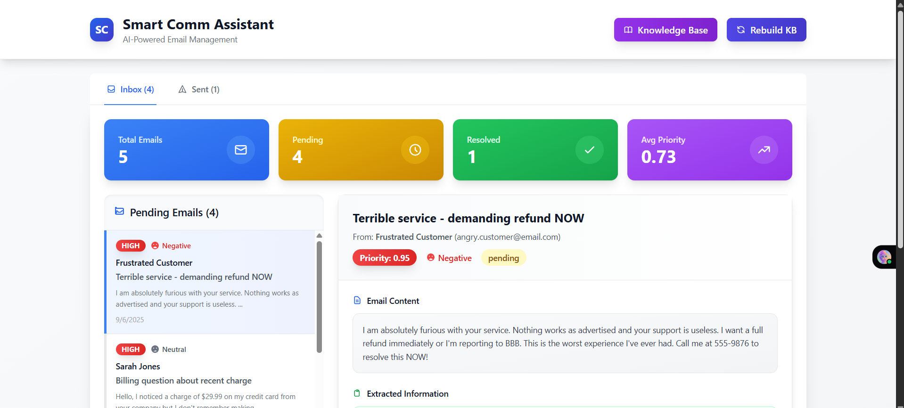
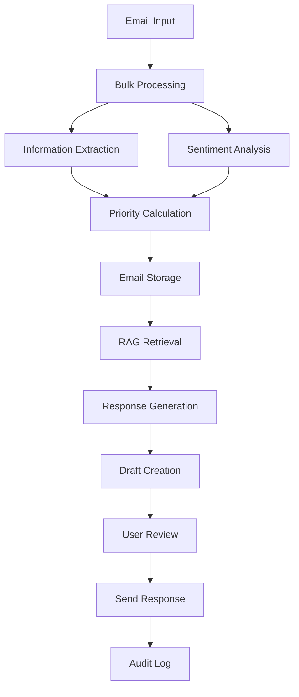

# Smart Communication Assistant

An AI-powered email management system that automates customer support email processing, analysis, and response generation using advanced machine learning and retrieval-augmented generation (RAG) techniques.

## 🚀 Features

- **Intelligent Email Processing**: Automatic sentiment analysis, priority scoring, and information extraction
- **RAG-Powered Responses**: Context-aware reply generation using knowledge base retrieval
- **Dynamic Knowledge Management**: Real-time knowledge base updates with automatic embedding rebuilding
- **Advanced Analytics**: Priority scoring, sentiment analysis, and performance metrics
- **Audit Trail**: Complete tracking of email lifecycle and user interactions
- **Modern UI**: Responsive React interface with real-time updates

## 🎥 Project Demo(Click here to watch the demo video)
[](https://drive.google.com/file/d/1cf27j9ugfFrQq701639cqjID5GS3CYuz/view?usp=sharing)

## 🏗️ Architecture

### High-Level Architecture

```
┌─────────────────┐    ┌─────────────────┐    ┌─────────────────┐
│   Frontend      │    │   Backend       │    │   AI Services   │
│   (React)       │◄──►│   (FastAPI)     │◄──►│   (Gemini AI)   │
└─────────────────┘    └─────────────────┘    └─────────────────┘
                              │
                              ▼
                    ┌─────────────────┐    ┌─────────────────┐
                    │   Database      │    │   Vector Store  │
                    │   (MongoDB)     │    │   (FAISS)       │
                    └─────────────────┘    └─────────────────┘
```

### Component Architecture

#### Frontend (React)
- **Email Management Interface**: Inbox and sent email views
- **Knowledge Base Admin**: CRUD operations for knowledge base items
- **Real-time Analytics**: Dashboard with metrics and insights
- **Responsive Design**: Modern UI with Tailwind CSS

#### Backend (FastAPI)
- **Email Processing Pipeline**: Ingestion, analysis, and response generation
- **RAG Engine**: Knowledge retrieval and context-aware generation
- **API Layer**: RESTful endpoints for all operations
- **Database Integration**: MongoDB for data persistence

#### AI Services
- **Google Gemini**: For sentiment analysis, information extraction, and response generation
- **Sentence Transformers**: For semantic embeddings and similarity search
- **FAISS**: For efficient vector similarity search

#### Data Storage
- **MongoDB**: Primary database for emails, knowledge base, and audit logs
- **FAISS Index**: Vector embeddings for semantic search
- **Collections**:
  - `emails`: Email documents with metadata and analysis
  - `knowledge_base`: Support documentation and FAQs
  - `sent_replies`: Audit trail of sent responses

## 🛠️ Technical Approach

### 1. Email Processing Pipeline

```
Email Input → Extraction → Sentiment Analysis → Priority Scoring → RAG Retrieval → Response Generation
```

**Information Extraction**:
- Phone numbers, alternate emails, order IDs
- Requested actions and urgency keywords
- Uses Google Gemini with structured prompts

**Sentiment Analysis**:
- Classifies emails as Positive, Neutral, or Negative
- Bulk processing for efficiency
- Influences priority scoring and response tone

**Priority Scoring**:
- Multi-factor algorithm considering urgency, sentiment, recency, and VIP status
- Weighted scoring: Urgency (60%), Sentiment (25%), Recency (10%), VIP (5%)

### 2. RAG (Retrieval-Augmented Generation)

**Knowledge Retrieval Process**:
1. **Embedding Generation**: Convert email content to vector embeddings using Sentence Transformers
2. **Similarity Search**: Use FAISS for efficient semantic search in knowledge base
3. **Context Assembly**: Retrieve top-k relevant documents with confidence scores
4. **Response Generation**: Use Gemini AI with retrieved context for accurate, grounded responses

**Dynamic Knowledge Base**:
- Real-time updates trigger automatic embedding rebuilding
- Versioned knowledge with audit trails
- Category-based organization for better retrieval

### 3. Vector Similarity Search

**Embedding Model**: `all-MiniLM-L6-v2` (384 dimensions)
- Fast inference and good semantic understanding
- Normalized vectors for cosine similarity via inner product

**FAISS Configuration**:
- `IndexFlatIP`: Exact search with inner product similarity
- Real-time index rebuilding on knowledge base updates
- Efficient batch processing for multiple queries

### 4. Response Generation Strategy

**Context-Aware Generation**:
- Combines email content, extracted information, and retrieved knowledge
- Maintains consistent brand voice and professional tone
- Confidence scoring for response quality assessment

**Multi-Modal Prompting**:
- Structured prompts with role-based instructions
- JSON output format for reliable parsing
- Temperature control for consistent outputs

### 5. Data Flow



## 📋 Prerequisites

- Python 3.8+
- Node.js 14+
- MongoDB 4.4+
- Google Gemini API key

## 🚀 Installation

### Backend Setup

1. **Clone the repository**:
```bash
git clone <repository-url>
cd smart-communication-assistant
```

2. **Create virtual environment**:
```bash
cd backend
python -m venv venv
source venv/bin/activate  # On Windows: venv\Scripts\activate
```

3. **Install dependencies**:
```bash
pip install -r requirements.txt
```

4. **Environment configuration**:
Create `.env` file in the backend directory:
```env
MONGO_URL=mongodb://localhost:27017
DB_NAME=smart_comm_assistant
GEMINI_API_KEY=your_gemini_api_key_here
CORS_ORIGINS=http://localhost:3000
```

5. **Start the server**:
```bash
python server.py
```

### Frontend Setup

1. **Install dependencies**:
```bash
cd frontend
npm install
```

2. **Start development server**:
```bash
npm start
```

## 📊 API Endpoints

### Email Management
- `POST /api/emails/ingest/mock` - Load demo emails
- `GET /api/emails` - List emails with filtering
- `GET /api/emails/{email_id}` - Get email details
- `POST /api/emails/{email_id}/generate` - Generate AI reply
- `POST /api/emails/{email_id}/send` - Send reply

### Knowledge Base
- `GET /api/knowledge-base` - List knowledge base items
- `POST /api/knowledge-base` - Create knowledge base item
- `PUT /api/knowledge-base/{item_id}` - Update knowledge base item
- `DELETE /api/knowledge-base/{item_id}` - Delete knowledge base item
- `POST /api/knowledge-base/rebuild` - Rebuild vector index

### Analytics
- `GET /api/analytics` - Get system analytics

## 🔧 Configuration

### Priority Scoring Weights
```python
PRIORITY_WEIGHTS = {
    'urgency': 0.6,      # Urgency keywords detection
    'sentiment': 0.25,   # Negative sentiment priority
    'recency': 0.1,      # Recent emails get priority
    'vip': 0.05         # VIP sender detection
}
```

### AI Model Configuration
```python
GENERATION_CONFIG = {
    'temperature': 0.0,           # Deterministic outputs
    'max_output_tokens': 512,     # Response length limit
    'model': 'gemini-2.0-flash-exp'  # Latest Gemini model
}
```

### Vector Search Parameters
```python
EMBEDDING_CONFIG = {
    'model': 'all-MiniLM-L6-v2',  # Sentence transformer model
    'dimension': 384,              # Vector dimension
    'top_k': 3,                   # Number of retrieved documents
    'similarity_threshold': 0.5    # Minimum similarity score
}
```

## 🧪 Usage Examples

### Loading Demo Data
```bash
curl -X POST http://localhost:8000/api/emails/ingest/mock
```

### Generating AI Response
```bash
curl -X POST http://localhost:8000/api/emails/{email_id}/generate
```

### Adding Knowledge Base Item
```bash
curl -X POST http://localhost:8000/api/knowledge-base \
  -H "Content-Type: application/json" \
  -d '{
    "title": "Shipping Policy",
    "content": "We offer free shipping on orders over $50...",
    "category": "shipping"
  }'
```

## 📈 Performance Considerations

### Scalability
- **Async Processing**: All AI operations are asynchronous
- **Bulk Operations**: Batch processing for multiple emails
- **Vector Indexing**: FAISS provides O(log n) search complexity
- **Database Indexing**: MongoDB indexes on frequently queried fields

### Optimization
- **Embedding Caching**: Reuse embeddings when possible
- **Connection Pooling**: MongoDB connection optimization
- **Response Streaming**: Large response streaming support
- **Rate Limiting**: AI API rate limiting and retry logic

### Memory Management
- **Lazy Loading**: Load embeddings only when needed
- **Batch Processing**: Process emails in configurable batches
- **Vector Storage**: Efficient float32 storage in FAISS

## 🔒 Security

- **Input Validation**: Pydantic models for request validation
- **API Authentication**: Ready for JWT/OAuth integration
- **Data Sanitization**: XSS and injection prevention
- **CORS Configuration**: Configurable cross-origin policies

## 🐛 Troubleshooting

### Common Issues

**MongoDB Connection Error**:
```bash
# Check MongoDB status
sudo systemctl status mongod

# Start MongoDB
sudo systemctl start mongod
```

**Gemini API Rate Limits**:
- Implement exponential backoff
- Use batch processing for multiple requests
- Monitor API quota usage

**FAISS Index Corruption**:
```bash
# Rebuild knowledge base index
curl -X POST http://localhost:8000/api/knowledge-base/rebuild
```

### Debug Mode
Set environment variable for detailed logging:
```bash
export LOG_LEVEL=DEBUG
```

## 🤝 Contributing

1. Fork the repository
2. Create a feature branch: `git checkout -b feature/new-feature`
3. Commit changes: `git commit -am 'Add new feature'`
4. Push to branch: `git push origin feature/new-feature`
5. Create Pull Request

## 📝 License

This project is licensed under the MIT License - see the [LICENSE](LICENSE) file for details.

## 🙏 Acknowledgments

- **Google Gemini**: Advanced language model capabilities
- **Sentence Transformers**: Semantic embedding generation
- **FAISS**: Efficient similarity search
- **FastAPI**: Modern Python web framework
- **React**: Frontend framework
- **MongoDB**: Document database

## 📞 Support

For support and questions:
- Create an issue in the GitHub repository
- Email: support@smartcommassistant.com
- Documentation: [Wiki](link-to-wiki)

---

*Built with ❤️ for intelligent customer communication*